# ADES — Diagrama Entidad-Relación (Core)

> Generado: 2026-06-23  
> Cubre las ~30 tablas principales. El esquema completo tiene 169 tablas `ades_*`.  
> PKs: UUID (uuidv7). Todas las tablas incluyen columnas de auditoría (`ref`, `row_version`, timestamps, usuario).

## Diagrama Mermaid

```mermaid
erDiagram
    %% ── CATÁLOGOS BASE ──────────────────────────────────────────
    ades_paises {
        UUID id PK
        string codigo_iso
        string nombre
    }
    ades_niveles_educativos {
        UUID id PK
        string codigo
        string nombre
        string sistema_educativo
    }
    ades_escuelas {
        UUID id PK
        string clave_ct
        string nombre
        string nivel
    }
    ades_estatus {
        UUID id PK
        string codigo
        string nombre
        string aplica_a
    }
    ades_grados {
        UUID id PK
        string nombre
        int numero
        UUID nivel_educativo_id FK
    }
    ades_roles {
        UUID id PK
        string nombre
        int nivel_acceso
    }

    %% ── INSTITUCIÓN ─────────────────────────────────────────────
    ades_planteles {
        UUID id PK
        string nombre_plantel
        string clave_ct
        UUID escuela_id FK
        UUID estatus_id FK
    }
    ades_plantel_niveles {
        UUID id PK
        UUID plantel_id FK
        UUID nivel_educativo_id FK
        UUID estatus_id FK
    }
    ades_ciclos_escolares {
        UUID id PK
        string nombre_ciclo
        string sistema_educativo
        date fecha_inicio
        date fecha_fin
        bool vigente
        UUID nivel_educativo_id FK
    }

    %% ── PERSONAS Y USUARIOS ─────────────────────────────────────
    ades_personas {
        UUID id PK
        string nombre
        string apellido_paterno
        string apellido_materno
        string curp
        string rfc
        date fecha_nacimiento
        string genero
        string email_personal
        string telefono
    }
    ades_usuarios {
        UUID id PK
        UUID persona_id FK
        UUID plantel_id FK
        UUID rol_id FK
        UUID nivel_educativo_id FK
        UUID estatus_id FK
        string username
        string email_institucional
        string authentik_id
        int nivel_acceso
    }
    ades_tutores_alumnos {
        UUID id PK
        UUID persona_id FK
        UUID alumno_id FK
        string parentesco
    }

    %% ── ALUMNOS ─────────────────────────────────────────────────
    ades_estudiantes {
        UUID id PK
        UUID persona_id FK
        UUID plantel_id FK
        UUID estatus_id FK
        string matricula
        date fecha_ingreso
        string tipo_alumno
        string folio_sep
    }
    ades_inscripciones {
        UUID id PK
        UUID estudiante_id FK
        UUID grupo_id FK
        UUID ciclo_escolar_id FK
        UUID estatus_id FK
        date fecha_inscripcion
    }

    %% ── PERSONAL DOCENTE ─────────────────────────────────────────
    ades_profesores {
        UUID id PK
        UUID persona_id FK
        UUID plantel_id FK
        UUID estatus_id FK
        string numero_empleado
        string tipo_contrato
        string cedula_profesional
    }

    %% ── ACADÉMICO ────────────────────────────────────────────────
    ades_materias {
        UUID id PK
        UUID nivel_educativo_id FK
        string nombre
        string clave
        string campo_formativo
        bool es_optativa
    }
    ades_materias_plan {
        UUID id PK
        UUID materia_id FK
        UUID grado_id FK
        UUID ciclo_escolar_id FK
        int horas_semana
        int creditos
    }
    ades_grupos {
        UUID id PK
        UUID ciclo_escolar_id FK
        UUID grado_id FK
        UUID aula_id FK
        UUID profesor_titular_id FK
        UUID estatus_id FK
        string nombre_grupo
        int cupo_maximo
    }
    ades_aulas {
        UUID id PK
        UUID plantel_id FK
        string nombre
        string tipo_aula
        int capacidad
    }
    ades_clases {
        UUID id PK
        UUID grupo_id FK
        UUID materia_id FK
        UUID profesor_id FK
        UUID horario_id FK
        date fecha_clase
        string estatus_clase
    }
    ades_asignaciones_docentes {
        UUID id PK
        UUID profesor_id FK
        UUID materia_id FK
        UUID grupo_id FK
        UUID ciclo_escolar_id FK
    }

    %% ── EVALUACIÓN ───────────────────────────────────────────────
    ades_periodos_evaluacion {
        UUID id PK
        UUID ciclo_escolar_id FK
        string nombre
        string tipo
        date fecha_inicio
        date fecha_fin
        int numero_periodo
    }
    ades_calificaciones_periodo {
        UUID id PK
        UUID estudiante_id FK
        UUID materia_id FK
        UUID grupo_id FK
        UUID periodo_evaluacion_id FK
        UUID cerrado_por FK
        decimal calificacion_final
        string calificacion_cualitativa
        bool periodo_cerrado
    }
    ades_calificaciones_evaluaciones {
        UUID id PK
        UUID evaluacion_id FK
        UUID estudiante_id FK
        decimal calificacion
        string comentario
    }

    %% ── BIBLIOTECA ───────────────────────────────────────────────
    ades_biblioteca_libros {
        UUID id PK
        UUID plantel_id FK
        string isbn
        string titulo
        string autor
        int ejemplares_total
        int ejemplares_disponibles
    }
    ades_biblioteca_prestamos {
        UUID id PK
        UUID libro_id FK
        UUID persona_id FK
        UUID plantel_id FK
        date fecha_prestamo
        date fecha_devolucion_esperada
        date fecha_devolucion_real
        string estatus
    }

    %% ── SALUD ────────────────────────────────────────────────────
    ades_incidentes_medicos {
        UUID id PK
        UUID estudiante_id FK
        UUID personal_salud_id FK
        date fecha_incidente
        string descripcion
        string tipo_incidente
        bool requirio_traslado
    }

    %% ── RELACIONES ───────────────────────────────────────────────
    ades_escuelas ||--o{ ades_planteles : "tiene"
    ades_planteles ||--o{ ades_plantel_niveles : "ofrece"
    ades_niveles_educativos ||--o{ ades_plantel_niveles : "en"
    ades_niveles_educativos ||--o{ ades_ciclos_escolares : "rige"
    ades_niveles_educativos ||--o{ ades_materias : "pertenece"
    ades_ciclos_escolares ||--o{ ades_grupos : "tiene"
    ades_ciclos_escolares ||--o{ ades_inscripciones : "de"
    ades_ciclos_escolares ||--o{ ades_periodos_evaluacion : "define"
    ades_ciclos_escolares ||--o{ ades_asignaciones_docentes : "en"
    ades_ciclos_escolares ||--o{ ades_materias_plan : "aplica"
    ades_personas ||--|| ades_estudiantes : "es"
    ades_personas ||--|| ades_profesores : "es"
    ades_personas ||--|| ades_usuarios : "tiene"
    ades_personas ||--o{ ades_tutores_alumnos : "es tutor de"
    ades_personas ||--o{ ades_biblioteca_prestamos : "solicita"
    ades_estudiantes ||--o{ ades_tutores_alumnos : "tiene tutor"
    ades_estudiantes ||--o{ ades_inscripciones : "se inscribe"
    ades_estudiantes ||--o{ ades_calificaciones_periodo : "recibe"
    ades_estudiantes ||--o{ ades_calificaciones_evaluaciones : "obtiene"
    ades_estudiantes ||--o{ ades_incidentes_medicos : "presenta"
    ades_profesores ||--o{ ades_clases : "imparte"
    ades_profesores ||--o{ ades_asignaciones_docentes : "asignado"
    ades_profesores ||--o{ ades_grupos : "titular de"
    ades_planteles ||--o{ ades_estudiantes : "pertenece"
    ades_planteles ||--o{ ades_profesores : "pertenece"
    ades_planteles ||--o{ ades_usuarios : "accede"
    ades_planteles ||--o{ ades_biblioteca_libros : "tiene"
    ades_planteles ||--o{ ades_biblioteca_prestamos : "presta en"
    ades_aulas ||--o{ ades_grupos : "asignada a"
    ades_grupos ||--o{ ades_inscripciones : "contiene"
    ades_grupos ||--o{ ades_clases : "genera"
    ades_grupos ||--o{ ades_calificaciones_periodo : "en"
    ades_grupos ||--o{ ades_asignaciones_docentes : "para"
    ades_grados ||--o{ ades_grupos : "de grado"
    ades_grados ||--o{ ades_materias_plan : "en grado"
    ades_materias ||--o{ ades_clases : "de"
    ades_materias ||--o{ ades_asignaciones_docentes : "asignatura"
    ades_materias ||--o{ ades_calificaciones_periodo : "evaluada en"
    ades_materias ||--o{ ades_materias_plan : "incluida"
    ades_periodos_evaluacion ||--o{ ades_calificaciones_periodo : "cierra"
    ades_biblioteca_libros ||--o{ ades_biblioteca_prestamos : "prestado como"
    ades_roles ||--o{ ades_usuarios : "asignado a"
    ades_estatus ||--o{ ades_estudiantes : "estado"
    ades_estatus ||--o{ ades_profesores : "estado"
    ades_estatus ||--o{ ades_grupos : "estado"
    ades_estatus ||--o{ ades_planteles : "estado"
    ades_estatus ||--o{ ades_inscripciones : "estado"
    ades_usuarios ||--o{ ades_calificaciones_periodo : "cierra periodo"
```

## Tablas adicionales (no incluidas en el diagrama)

| Dominio | Tablas clave |
|---------|-------------|
| Evaluación avanzada | `ades_evaluaciones`, `ades_calificaciones_evaluaciones`, `ades_rubricas`, `ades_rubrica_criterios` |
| Gradebook 360° | `ades_eval_docente`, `ades_items_ponderacion`, `ades_nee`, `ades_calificaciones_tareas` |
| Salud completo | `ades_condiciones_cronicas`, `ades_medicamentos_alumno`, `ades_personal_salud`, `ades_seguimiento_psicosocial` |
| Conducta | `ades_sanciones_disciplinarias`, `ades_reportes_conducta`, `ades_acuerdos_convivencia` |
| RRHH | `ades_licencias_personal`, `ades_capacitaciones_docente`, `ades_personal_administrativo`, `ades_asistencia_personal` |
| Planeación | `ades_planeacion_clases`, `ades_temas`, `ades_avance_planificacion`, `ades_clases` |
| Comunicación | `ades_comunicados`, `ades_anuncios`, `ades_mensajes_foro`, `ades_notificaciones` |
| Tareas | `ades_tareas`, `ades_tareas_entregas`, `ades_calificaciones_tareas` |
| E-learning | `ades_h5p_contenidos`, `ades_h5p_resultados`, `ades_bbb_reuniones`, `ades_learning_paths` |
| Certificación | `ades_certificados`, `ades_llaves_firma`, `ades_constancias` |
| Geo/SEPOMEX | `ades_codigos_postales`, `ades_municipios`, `ades_localidades` |
| Seguridad | `ades_log_autenticacion`, `ades_webhooks`, `ades_webhook_logs`, `ades_audit_log` |
| Calendario | `ades_calendario_escolar`, `ades_periodos_inscripcion` |
| Biblioteca | `ades_biblioteca_libros`, `ades_biblioteca_prestamos` |
| IA | `ades_ai_conversaciones`, `ades_alertas_academicas`, `ades_reportes_academicos` |
| Reportes SEP | Vistas materializadas sobre las tablas anteriores |

## Convenciones de diseño

- **PK**: siempre `UUID` generado con `uuidv7()` o `gen_random_uuid()`
- **Auditoría**: todas las tablas tienen `ref UUID`, `row_version INTEGER`, `fecha_creacion TIMESTAMPTZ`, `fecha_modificacion TIMESTAMPTZ`, `usuario_creacion TEXT`, `usuario_modificacion TEXT`
- **Soft delete**: campo `is_active BOOLEAN DEFAULT true`; nunca `DELETE` físico
- **Optimistic locking**: PATCH/PUT verifican `row_version` antes de actualizar
- **Particionamiento**: `ades_asistencias` y `ades_calificaciones_periodo` particionadas por `ciclo_escolar_id` (rango de años 2024–2028)
